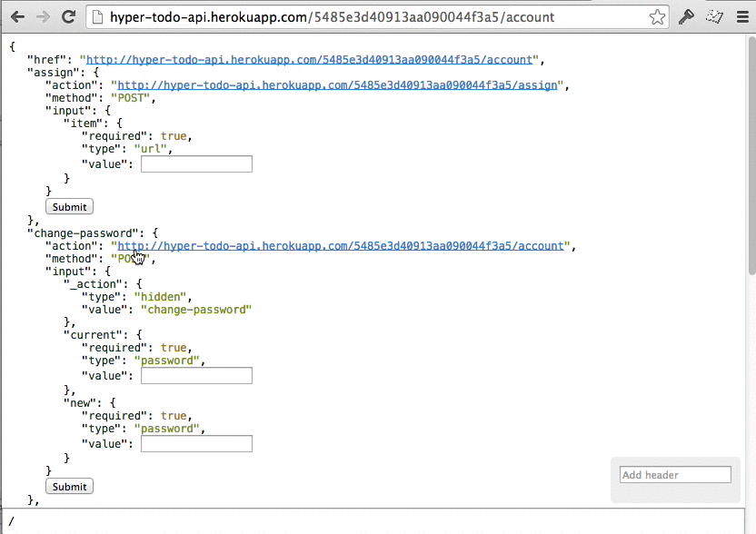
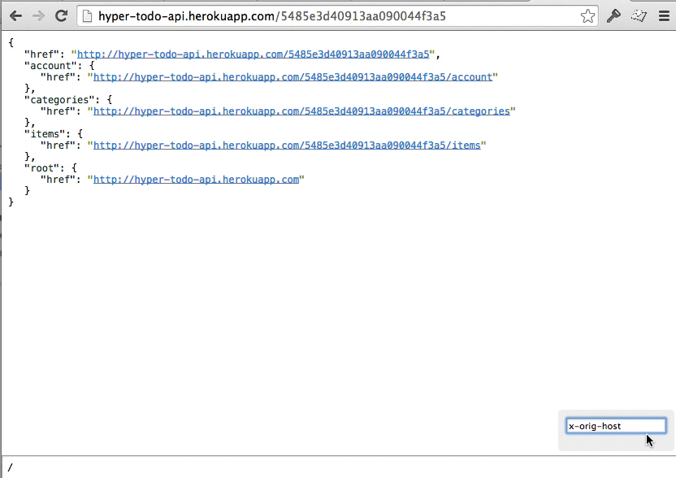

hyper.chrome
============

Hyper client for chrome

Installation
------------

[Chrome Webstore](https://chrome.google.com/webstore/detail/hyperchrome/micpjacfpmndnocgeldgmhdgjeaiokhk)

Features
--------

### Deep link

Deep link into the JSON payload.



### Headers

Send any needed headers for the request.



### Omnibox

Type `hyper!` and hit `TAB` to input arbitrary JSON.


### Search

Search for properties using [JSON Pointer syntax](http://tools.ietf.org/html/rfc6901).


Development
-----------

```sh
$ git clone https://github.com/hypergroup/hyper.chrome.git
$ cd hyper.chrome
$ npm i
$ make dev
```
